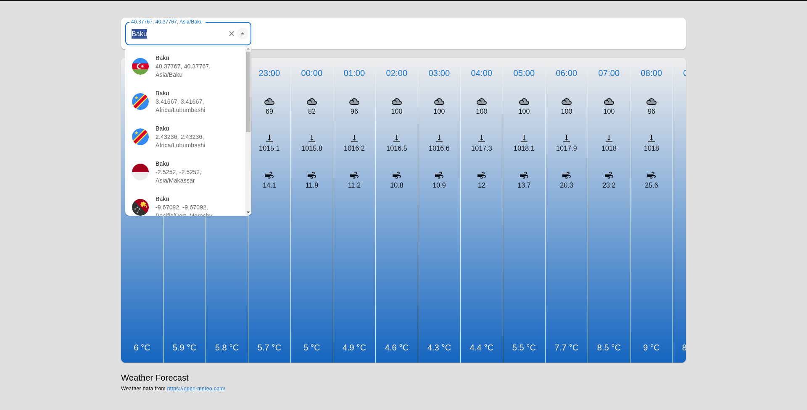
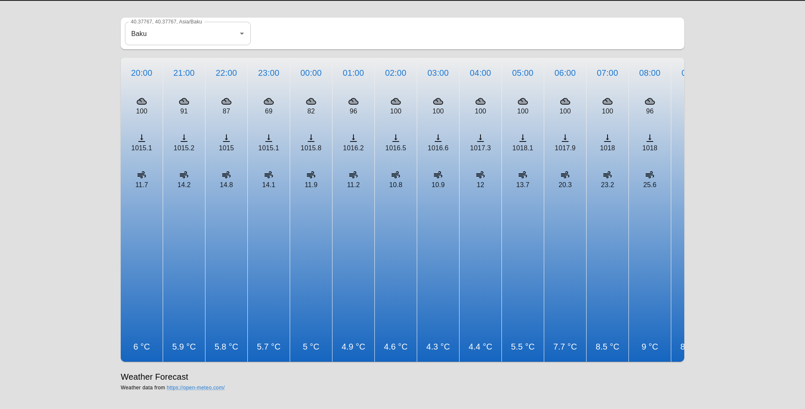
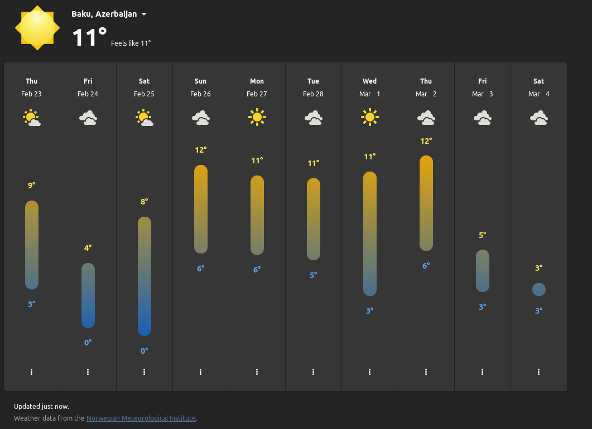
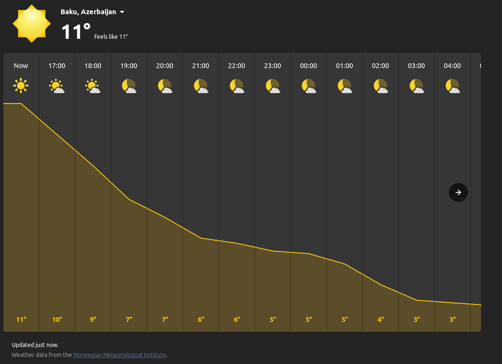

# What's it?

it's a project for understanding how to fetch forecast by city's name from https://open-meteo.com/.

# Result

  

  

# Examples for develop

  

  

# Technical stack

- TypeScript
- Eslint (airbnb)
- prettier
- react
- redux
- redux-toolkit
- i18next
- RTK Query
- MUI + styled-component + MUI icons
- MUI themes
- Vite instead of webpack and cra

# Sources
- [RTK Query](https://redux-toolkit.js.org/rtk-query/overview)
  - [Utilities](https://redux-toolkit.js.org/rtk-query/api/created-api/api-slice-utils)
  - [Cache Behavior](https://redux-toolkit.js.org/rtk-query/usage/cache-behavior)
- [react-i18next](https://react.i18next.com/getting-started)
- [new Date().getDay()](https://developer.mozilla.org/en-US/docs/Web/JavaScript/Reference/Global_Objects/Date/getDay)
- [mui dark/light theme](https://mui.com/material-ui/customization/dark-mode/)